# Playwright Azure Monitor Reporter

This plugin sends Playwright test results to Azure Monitor Log Analytics, allowing you to centralize, analyze, and visualize your test metrics in Azure.

This guide will instruct you on how to create the Azure resources in order for this plugin to work and insert logs into the Log Analytics workspace.

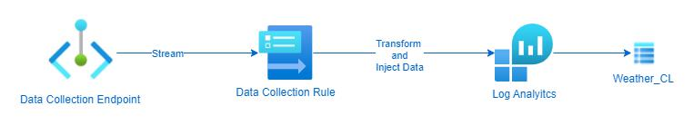

## Table of Contents

- [Playwright Azure Monitor Reporter](#playwright-azure-monitor-reporter)
  - [Table of Contents](#table-of-contents)
  - [Create an Azure Data Collection Endpoint](#create-an-azure-data-collection-endpoint)
  - [Create an Azure Data Collection Table and Rule](#create-an-azure-data-collection-table-and-rule)
    - [Create the Table](#create-the-table)
    - [Create the Rule](#create-the-rule)
    - [Continue to configure the custom log](#continue-to-configure-the-custom-log)
  - [Configure Playwright with Reporter](#configure-playwright-with-reporter)
    - [Create Environment Variables](#create-environment-variables)
    - [Configure Playwright](#configure-playwright)
  - [Run a Playwright test](#run-a-playwright-test)
  - [Conclusion](#conclusion)


## Create an Azure Data Collection Endpoint

Azure Data Collection Endpoints are used to ingest data into Azure Monitor Logs.

Steps to create a Data Collection Endpoint via Azure Portal:

1. Navigate to Azure Monitor:

   - In the Azure portal, search for and select "Monitor".

2. Access Data Collection Endpoints:

   - In the Monitor menu, under the "Settings" section, select "Data Collection Endpoints".

   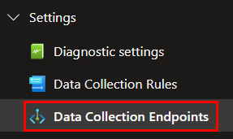

3. Create a New Endpoint:

   - Click on the "+ Create" button.

4. Basics Tab:

   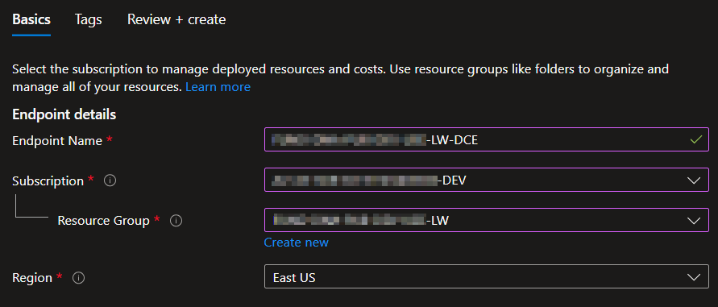

   - Endpoint Name: Provide a unique name for your data collection endpoint.
   - Subscription: Select your Azure subscription.
   - Resource Group: Choose an existing resource group or create a new one.
   - Region: Select the Azure region where you want to deploy the endpoint. This should ideally be the same region as your Log Analytics workspace and the resources sending data.
   - Click "Review + create".

5. Review + Create Tab:

   - bReview the configuration.
   - Click "Create".

Deployment will take a few moments. Once created, you can find your Data Collection Endpoint listed. You'll need its Logs ingestion URI when configuring data sources (like custom logs or using client libraries) to send data to Azure Monitor.

This endpoint acts as the ingestion point for data that will then be processed by Data Collection Rules (DCRs) before being sent to your Log Analytics workspace(s).

## Create an Azure Data Collection Table and Rule

Azure Data Collection Rules (DCRs) define what data to collect, how to transform it, and where to send it. They are used in conjunction with Data Collection Endpoints (DCEs) to ingest data into Azure Monitor Logs.

**Steps to create a Data Collection Rule via Azure Portal:**

### Create the Table

1. **Navigate to your log Log Analytics Workspace:**

   - In the Azure portal navigate to your Log Analytics workspace (LAW).

2. **Create a new Custom Log:**

   - Under the "Settings" section, select "Tables".
   - Click on the "+ Create" button.
     azure-monitor-dcr-01.png
     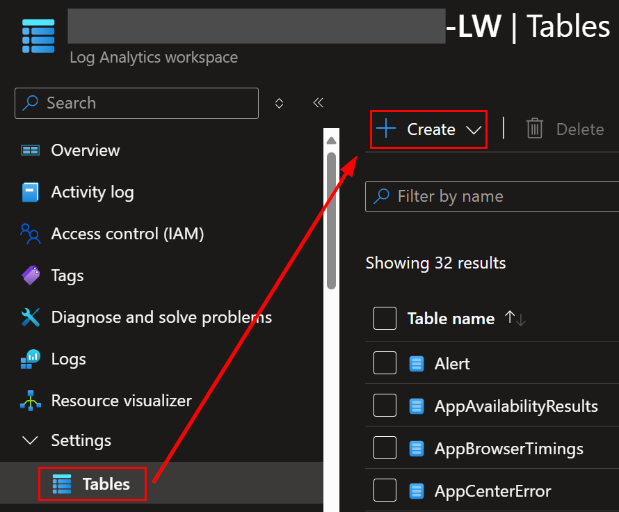

   - Select "New custom log (DCR-based)"
     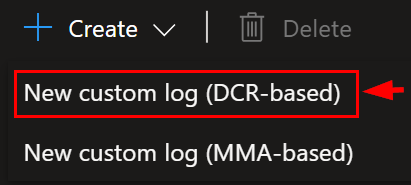

3. **Create a custom log**

   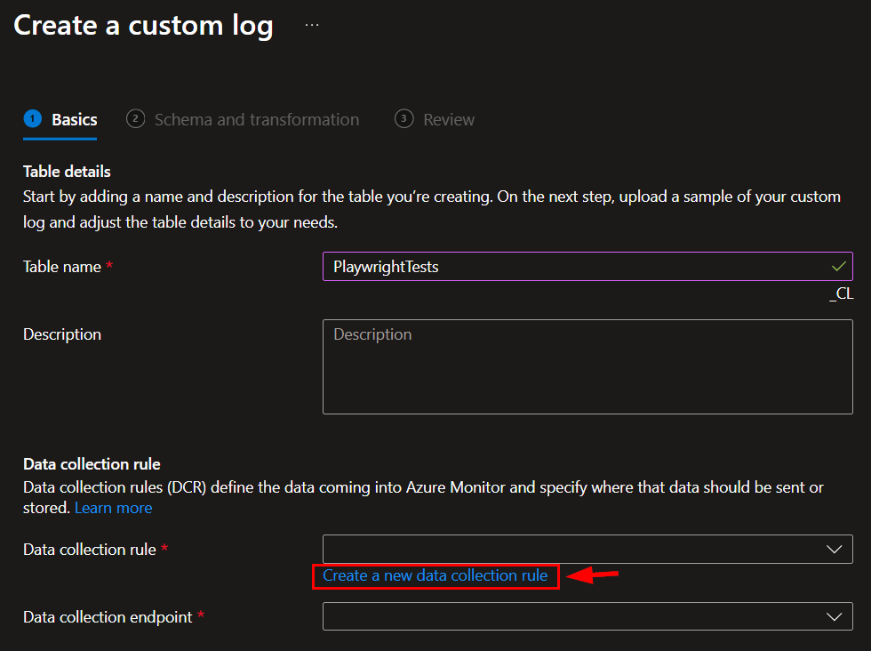

   - **Table Name**: Enter a new table name to store your logs.
   - **Data Collection Endpoint**: Select the endpoint created above.
   - **Data Collection Rule**: Click on "Create a new data collection rule" link

### Create the Rule

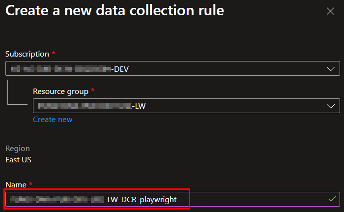

1. **Subscription:** Select your Azure subscription.

2. **Resource Group:** Choose an existing resource group or create a new one.

3. **Name:** Enter a unique name for your data collection rule.

4. Click Done.

### Continue to configure the custom log

1. Click "Next" to proceed after the Data Collection Rule is created.
2. Drag-and-drop the sample file [data-sample.json](../src/data-sample.json)

   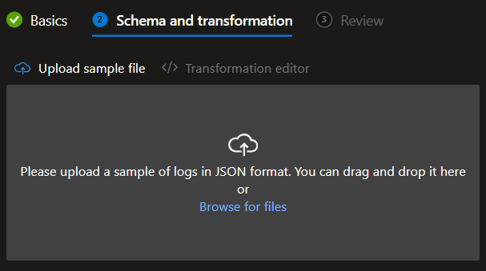

3. The uploaded sample will appear:

   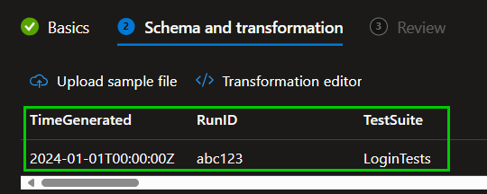

4. Click Next

5. Review and then click Next.

   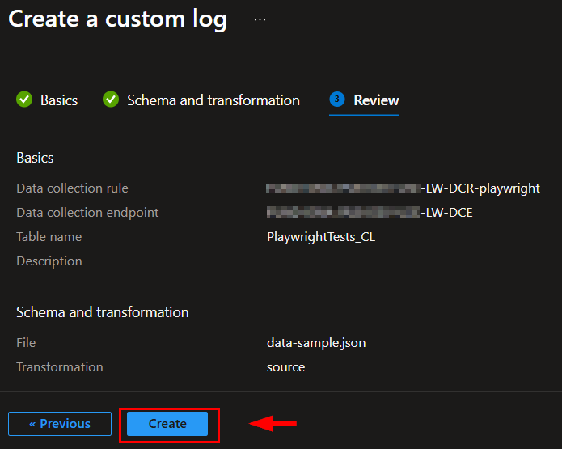

Once created, the DCR will be associated with the selected resources and will start collecting data according to the defined data sources and sending it to the specified destinations via the associated Data Collection Endpoint.

Be sure to note the Data Collection Rule **Immutable ID** and the **Data Source** from "Configuration >> Data sources", as they will be needed for configuring the Playwright configuration file.

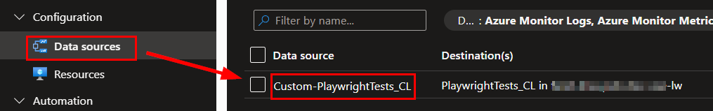

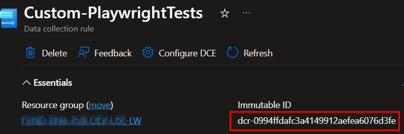

The new table **will not** appear in the LAW Tables until a log is sent to the endpoint.

## Configure Playwright with Reporter

### Create Environment Variables

In your Playwright project create this environment variables:

- **AZURE_TENANT_ID**: Your Azure Tenent ID
- **AZURE_CLIENT_ID**: Your Azure Client ID
- **AZURE_CLIENT_SECRET**: Your Azure Client Secret
- **LOG_ANALYTICS_DCE_ENDPOINT**: The ingestion URI from your Data Collection Endpoint
- **LOG_ANALYTICS_DCR_IMMUTABLE_ID**: The immutable ID of your Data Collection Rule
- **LOG_ANALYTICS_STREAM_NAME**: The stream name you defined in your DCR (e.g., Custom-PlaywrightTests_CL)


### Configure Playwright

```bash
  reporter: [
    ['list'], // or your existing reporters
    [
      './reporters/logAnalyticsReporter.ts',
      {
        projectName: 'Fundamentals Data Tests',
        azureTenantId: process.env.AZURE_TENANT_ID,
        azureClientId: process.env.AZURE_CLIENT_ID,
        azureClientSecret: process.env.AZURE_CLIENT_SECRET,
        environment: 'DEV',
        RunId: process.env.BUILD_BUILDID || process.env.CI_PIPELINE_RUN_ID || process.env.GITHUB_RUN_ID,
        commitSHA: process.env.BUILD_SOURCEVERSION || process.env.GIT_COMMIT_SHA || process.env.GITHUB_SHA,

        dceEndpoint: process.env.LOG_ANALYTICS_DCE_ENDPOINT,
        dcrImmutableId: process.env.LOG_ANALYTICS_DCR_IMMUTABLE_ID,
        streamName: process.env.LOG_ANALYTICS_STREAM_NAME,
      },
    ],
  ],
```


## Run a Playwright test

Once your Playwright configuration file is properly configured then execute your test(s) to make sure test results are transmitted.

1. Once your test is executed then you should see this log message to indicate a successful transmission to the Log Analytics workspace:

   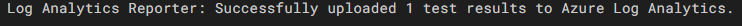

2. And the table is now visible:

   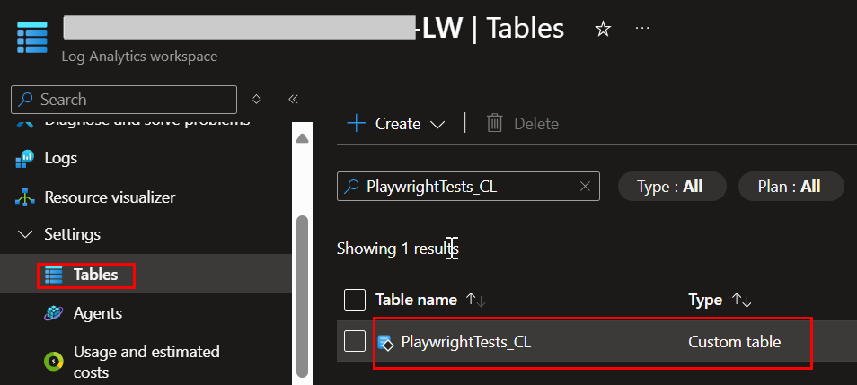

3. Query the table and you will see the record:

   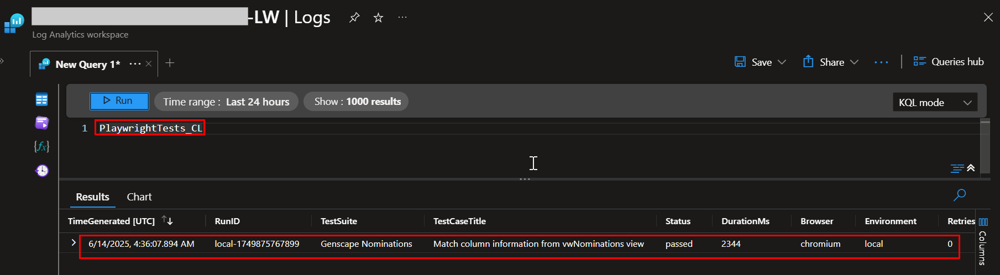

## Conclusion

This concludes the guide to leverage and make use of the reporter.
